# KrishiSetu

**KrishiSetu** is a tech-driven platform that empowers farmers by providing a **direct marketplace, government-backed storage, sustainable farming insights, and efficient delivery solutions**. Using **AI and IoT**, it optimizes inventory, minimizes wastage, and boosts farmer profits by reducing reliance on middlemen.

### **This project was nominated to SIH-2024 after getting selected in the top 30 out of 600+ projects in the internal hackathon.**

## Table of Contents
- [Key Features](#key-features)
  - [For Farmers](#for-farmers)
  - [For Buyers](#for-buyers)
  - [For Storage Workers](#for-storage-workers)
- [Installation](#installation)
- [Usage](#usage)

## Key Features

KrishiSetu offers a comprehensive set of features tailored to benefit three key groups: farmers, consumers, and storage workers. Each group witnesses different features designed to meet their specific needs and enhance their experience with the platform. The features for each group are detailed below.

<div style="display: flex; flex-direction: row; justify-content: space-around; align-items: center;">
  
  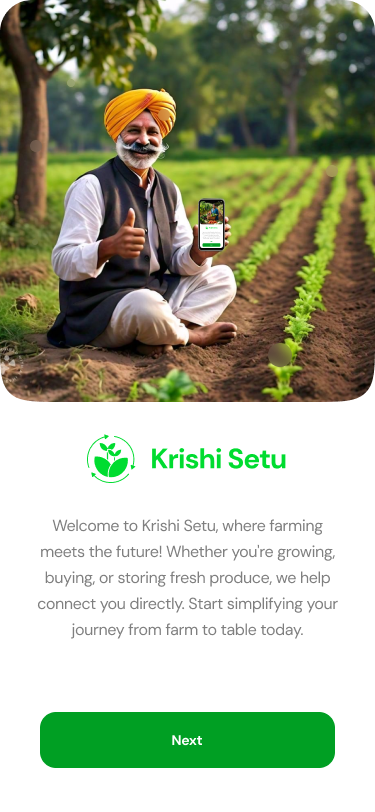
  
  
  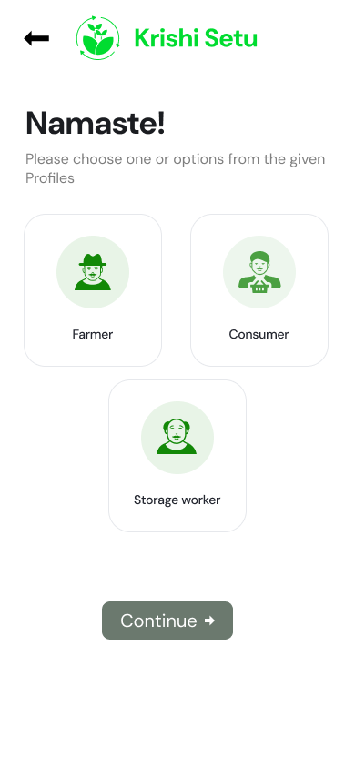
</div>

### For Farmers

- **Direct Marketplace** – Empowers farmers to sell directly to bulk buyers with AI-driven price prediction and quality assurance, eliminating middlemen and increasing profits.
- **Smart Storage & Logistics** – Provides government-backed cold storage facilities with IoT monitoring and AI-optimized logistics to ensure efficient storage and transportation of produce.
- **Government Schemes & MSP Integration** – Integrates with government schemes and Minimum Support Price (MSP) programs, offering MSP-backed storage and profit-sharing to ensure financial stability for farmers.
- **Data-Driven Insights** – Utilizes AI for comprehensive market trend analysis and predictive analytics, helping farmers make informed decisions.
- **Accessible & User-Friendly** – Supports multiple regional languages and features a simple, intuitive user interface designed specifically for farmers.

<div style="display: flex; flex-direction: row; justify-content: space-around; align-items: center;">
  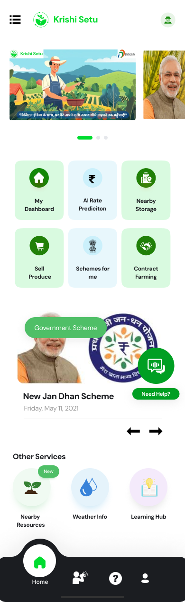
  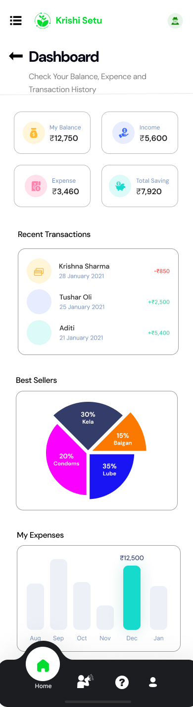
  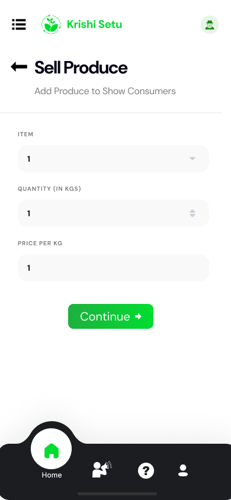
  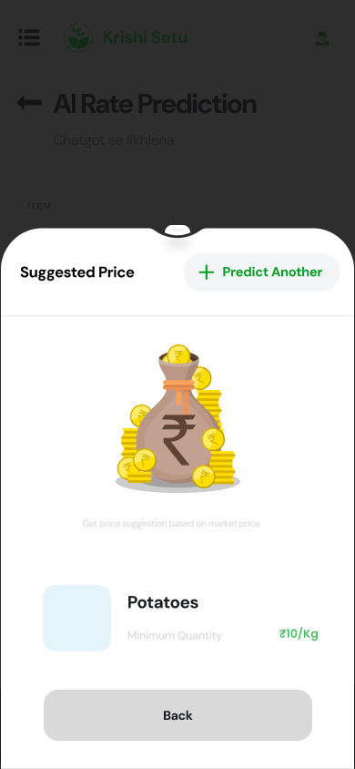
  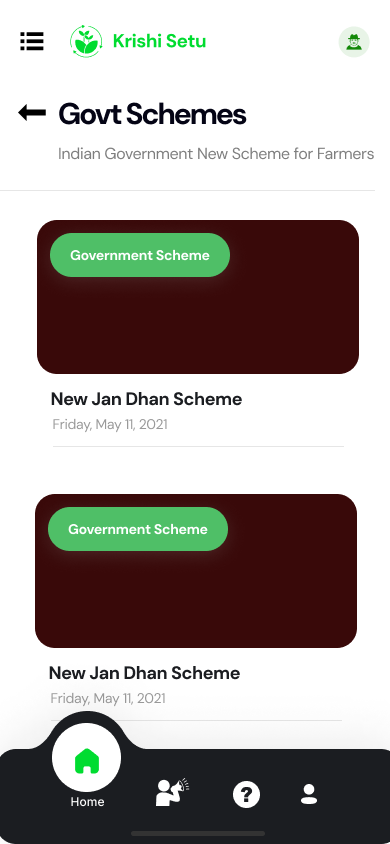
</div>

### For Buyers

- **Direct Farmer Connections** – Facilitates direct connections with farmers, enabling buyers to secure better pricing and high-quality produce.
- **Cold Storage Purchases** – Allows buyers to purchase produce from cold storage with real-time availability updates, ensuring freshness and quality.
- **Pre-Order Contracts** – Supports contract farming with pre-order agreements, providing buyers with a reliable supply of produce.
- **Order Tracking Dashboard** – Offers a comprehensive dashboard for tracking orders and viewing transaction history, enhancing transparency and efficiency.

<div style="display: flex; flex-direction: row; justify-content: space-around; align-items: center;">
  
  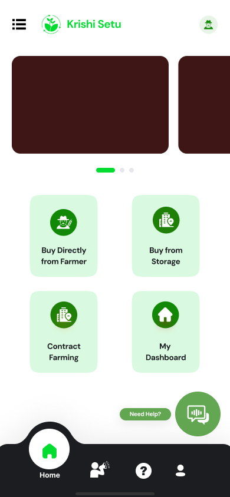
  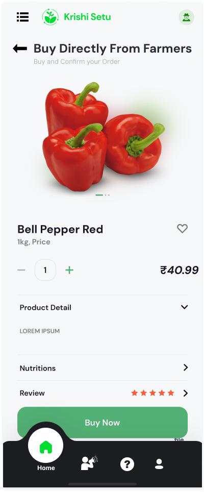
  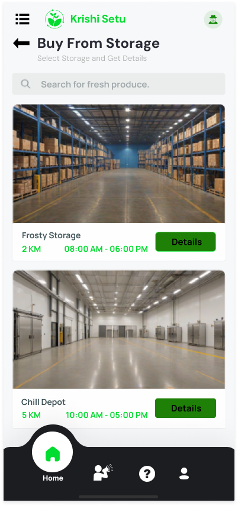
</div>

### For Storage Workers

- **Real-Time Inventory Management** – Enables storage workers to add and update inventory with real-time tracking, ensuring accurate stock levels.
- **Expiry Monitoring & Alerts** – Monitors produce expiry dates and sends alerts to minimize waste and ensure timely usage.
- **IoT-Based Environmental Monitoring** – Utilizes IoT technology to monitor environmental conditions within storage facilities, ensuring optimal produce quality.
- **Value-Added Processing** – Provides tools and processes for converting surplus produce into value-added products, reducing waste and increasing profitability.

<div style="display: flex; flex-direction: row; justify-content: space-around; align-items: center;">
  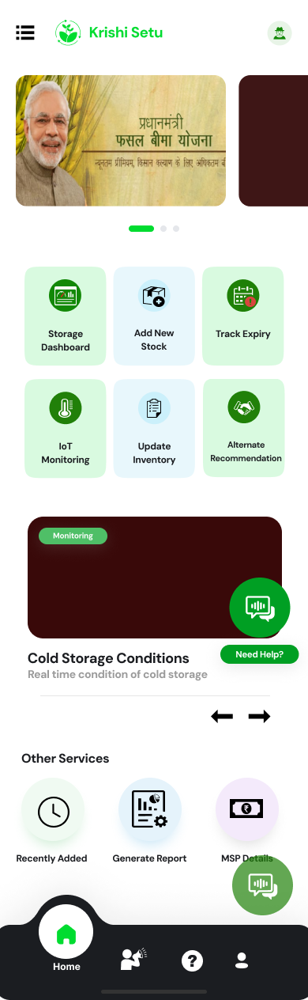
  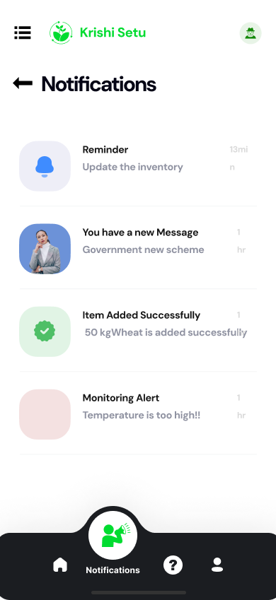
  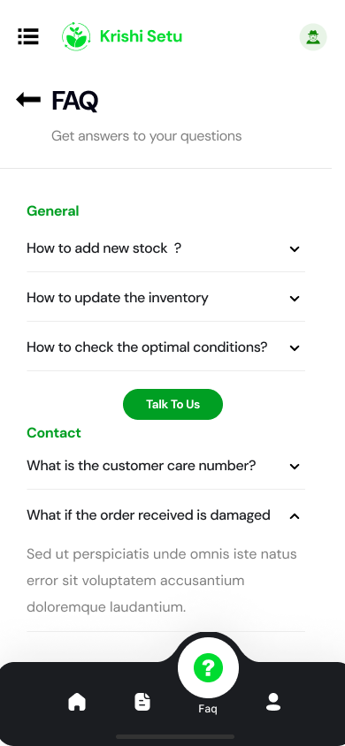
  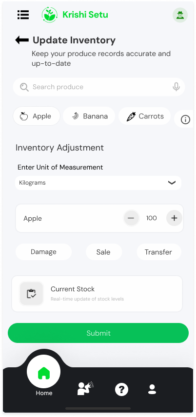
  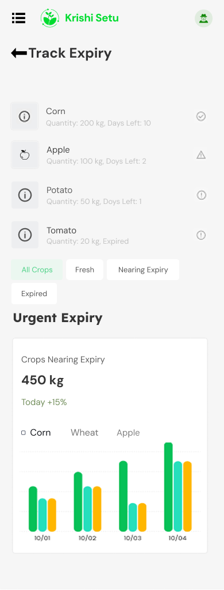
</div>

## Installation

To install KrishiSetu, follow these steps:

1. Clone the repository:
    ```bash
    git clone https://github.com/krishnas005/FarmConnect.git
    ```
2. Navigate to the project directory:
    ```bash
    cd KrishiSetu
    ```
3. Install the necessary dependencies:
    ```bash
    npm i
    ```

## Usage

Run the application:
    ```bash
    npm start
    ```
